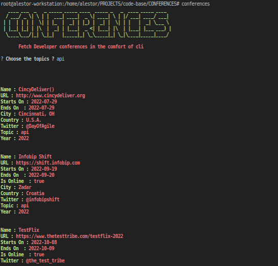
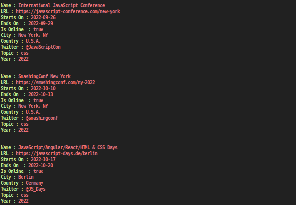

<h1 align=center>CONFERENCES</h1>

> This is a simple code for fetching developer events for the year

<p align=center>

<a href="https://github.com/alestor123/CONFERENCES/issues">
</a>

<a href="https://www.npmjs.com/package/conferences"></a>
</p>
<p align=center>
<a href="https://npmjs.org/package/conferences">
</a>
</p>

## 🚀 Usage

## API

```
const conferences = require('conferences');
(async () => {
  const data = await conferences(process.env.GHTOKEN, { topics: ['typescript'] })
  console.log(data)
})()
/*
[ { name: 'TypeVille',
       url: 'https://www.typeville.io',
       startDate: '2022-04-20',
       endDate: '2022-04-22',
       city: 'Krynica Zdrój',
       country: 'Poland',
       online: false,
       cfpUrl: 'https://sml.io/typeville',
       cfpEndDate: '2022-01-09',
       twitter: '@typevilleconf',
       cocUrl: 'https://www.typeville.io/',
       year: '2022',
       topic: 'typescript',
       isOver: true,
       month: 'April',
       thisMonth: false },
     { name: 'TS Congress',
       url: 'https://typescriptcongress.com',
       startDate: '2022-04-29',
       endDate: '2022-04-29',
       online: true,
       cfpUrl:
        'https://docs.google.com/forms/d/e/1FAIpQLScq-aWVf_oGvLdstVdsKJAfWzxpAsWoQNz_KrrGN2gqfASQ1A/viewform',
       cfpEndDate: '2022-03-01',
       twitter: '@ts_congress',
       cocUrl: 'https://typescriptcongress.com/coc',
       year: '2022',
       topic: 'typescript',
       isOver: true,
       month: 'April',
       thisMonth: false },
     { name: 'Render-Atlanta (RenderATL)',
       url: 'https://www.renderatl.com',
       startDate: '2022-06-01',
       endDate: '2022-06-04',
       city: 'Atlanta, GA',
       country: 'U.S.A.',
       online: false,
       twitter: '@RenderATL',
       cocUrl: 'RenderATL.com/thecode',
       offersSignLanguageOrCC: true,
       year: '2022',
       topic: 'typescript',
       isOver: true,
       month: 'June',
       thisMonth: true },
     { name: 'App.js Conf',
       url: 'https://appjs.co',
       startDate: '2022-06-08',
       endDate: '2022-06-10',
       city: 'Kraków',
       country: 'Poland',
       online: true,
       cfpUrl:
        'https://docs.google.com/forms/d/1-TUgnCqqGsTufBv2W5Nn8rXzoBg7qpBZKoQT0qKp7jA/edit',
       cfpEndDate: '2022-02-22',
       twitter: '@appjsconf',
       cocUrl: 'https://appjs.co/Code-of-Conduct.pdf',
       offersSignLanguageOrCC: true,
       year: '2022',
       topic: 'typescript',
       isOver: true,
       month: 'June',
       thisMonth: true },
     { name: 'Prisma Day',
       url: 'https://www.prisma.io/day',
       startDate: '2022-06-15',
       endDate: '2022-06-16',
       city: 'Berlin',
       country: 'Germany',
       online: true,
       cfpUrl: 'https://prisma103696.typeform.com/to/Gm9zMrKA',
       cfpEndDate: '2022-04-25',
       twitter: '@prisma',
       cocUrl:
        'https://github.com/prisma/prisma/blob/main/CODE_OF_CONDUCT.md',
       year: '2022',
       topic: 'typescript',
       isOver: false,
       month: 'June',
       thisMonth: true },
     { name: 'React Summit',
       url: 'https://reactsummit.com',
       startDate: '2022-06-17',
       endDate: '2022-06-21',
       city: 'Amsterdam',
       country: 'Netherlands',
       online: true,
       cfpUrl:
        'https://docs.google.com/forms/d/e/1FAIpQLSfVG_bNAebxhlERx1do33ekcmkLx25f1wh478MPv2CW6UvMlw/viewform',
       cfpEndDate: '2022-03-20',
       twitter: '@ReactSummit',
       cocUrl: 'https://reactsummit.com/coc',
       year: '2022',
       topic: 'typescript',
       isOver: false,
       month: 'June',
       thisMonth: true },
     { name: 'FullStack eXchange',
       url:
        'https://skillsmatter.com/conferences/13770-fullstack-exchange-2022',
       startDate: '2022-07-27',
       endDate: '2022-07-28',
       city: 'London',
       country: 'U.K.',
       online: true,
       cfpUrl:
        'https://skillsmatter.com/conferences/13727-fullstack-exchange-online#get_involved',
       cfpEndDate: '2022-04-28',
       twitter: '@skillsmatter',
       cocUrl: 'https://skillsmatter.com/go/code-of-conduct',
       year: '2022',
       topic: 'typescript',
       isOver: false,
       month: 'July',
       thisMonth: false },
     { name: 'CascadiaJS',
       url: 'https://2022.cascadiajs.com',
       startDate: '2022-08-30',
       endDate: '2022-09-02',
       city: 'Bend, OR',
       country: 'U.S.A.',
       online: false,
       twitter: '@cascadiajs',
       cocUrl: 'https://2022.cascadiajs.com/code-of-conduct',
       offersSignLanguageOrCC: true,
       year: '2022',
       topic: 'typescript',
       isOver: false,
       month: 'August',
       thisMonth: false },
     { name: 'Infobip Shift',
       url: 'https://shift.infobip.com',
       startDate: '2022-09-19',
       endDate: '2022-09-20',
       city: 'Zadar',
       country: 'Croatia',
       online: true,
       cfpUrl: 'https://sessionize.com/infobipshift',
       cfpEndDate: '2022-07-01',
       twitter: '@infobipshift',
       cocUrl: 'https://shift.infobip.com/code/',
       year: '2022',
       topic: 'typescript',
       isOver: false,
       month: 'September',
       thisMonth: false },
     { name: 'International JavaScript Conference',
       url: 'https://javascript-conference.com/new-york',
       startDate: '2022-09-26',
       endDate: '2022-09-29',
       city: 'New York, NY',
       country: 'U.S.A.',
       online: true,
       twitter: '@JavaScriptCon',
       year: '2022',
       topic: 'typescript',
       isOver: false,
       month: 'September',
       thisMonth: false },
     { name: 'DevTernity',
       url: 'https://devternity.com',
       startDate: '2022-12-08',
       endDate: '2022-12-09',
       online: true,
       twitter: '@devternity',
       cocUrl: 'https://devternity.com/code_of_conduct.html',
       year: '2022',
       topic: 'typescript',
       isOver: false,
       month: 'December',
       thisMonth: false } ] }
*/
```

## Quick use
```
$ npx conferences 
```
## CLI Installation
```
$ npm install -g conferences
```
```
$ conferences
```
# Screenshots    





## 💖 [Donate](https://alestor123.is-a.dev/donate)


## Author

👤 **Alestor Aldous**

- Twitter: [@alestor123](https://twitter.com/alestor123)
- Github: [@alestor123](https://github.com/alestor123)


## 📝 License
> MIT

Copyright © 2022 [Alestor Aldous](https://github.com/alestor123).<br />